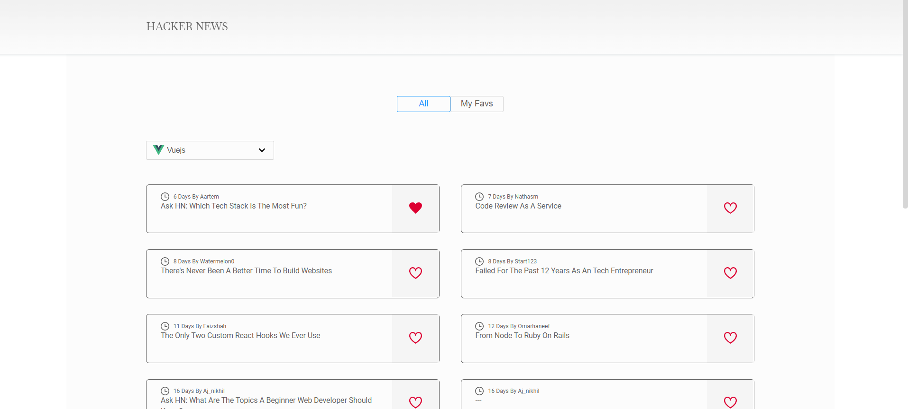
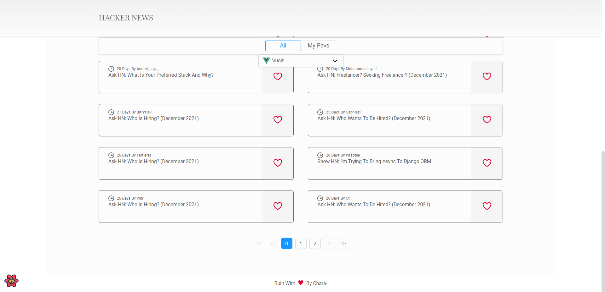
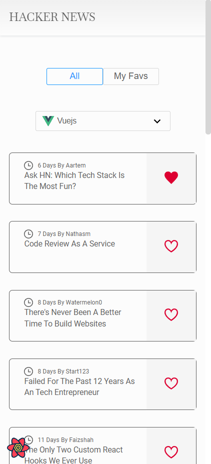

<h1 align="center">Hacker News</h1>

<div align="center">

  <a href="https://hacker-news-flame.vercel.app/" target="_blank">
    
  </a>

  <a href="https://hacker-news-flame.netlify.app/" target="_blank">
    
  </a>
  <a href="https://dashboard.cypress.io/projects/kjcjo4/runs">
    
  </a>

  <a href="https://61cafd37947d3e003a8de1dc-dajoisnbhx.chromatic.com/?path=/story/atoms-button--basic">
    
  </a>

</div>

<!-- TABLE OF CONTENTS -->

## 🔥 Table of Contents

- [Built With](#built-with)
- [Overview](#overview)
- [Features](#features)
- [How to use](#how-to-use)
- [Contact](#contact)
- [Acknowledgements](#acknowledgements)

## Built with

<div align="center">

  <a href="https://www.cypress.io/">
    
  </a>

  <a href="https://developer.mozilla.org/es/docs/Web/JavaScript">
    
  </a>

  <a href="https://reactjs.org/">
    
  </a>

   <a href="https://react-query.tanstack.com/">
    
  </a>

</div>

<div align="center">

  <a href="https://storybook.js.org/">
    
  </a>

  <a href="https://styled-components.com/">
    
  </a>

  <a href="https://www.typescriptlang.org/">
    
  </a>

  <a href="https://vitejs.dev/">
    
  </a>

</div>

## Overview

<details>
  <summary>💻 Desktop version</summary>




</details>

<details>
  <summary>📱 Mobile version</summary>




</details>

## Features

This is a project that started with [`npm init vite@latest hacker-news -- --template react-ts`](https://vitejs.dev/guide/#scaffolding-your-first-vite-project), started as a result of a frontend development challenge by [REIGN](https://www.reign.cl/).

## How To Use

### Step 1. Getting Started

To clone and run this application, you'll need [Git](https://git-scm.com), [Node.js](https://nodejs.org/en/download/) (which comes with [npm](http://npmjs.com)) installed on your computer and [Yarn](https://yarnpkg.com/getting-started/install). From your command line:

```bash
# Clone this repository
$ git clone https://github.com/jcarlos0511/hacker-news.git

# Enter the created folder
$ cd hacker-news

# Install dependencies
$ npm install

# or
$ yarn install

```

### Step 2. Set up environment variables

Create a new file `.env.local` (which will be ignored by Git):

```bash

touch .env.local

```

Set variable on `.env.local`:

```bash

VITE_APP_API_BASE_URL : https://hn.algolia.com/api/v1

# Run the app
$ npm run dev

# or
$ yarn dev

# Visit http://localhost:3000/

```

Open [http://localhost:3000](http://localhost:3000) with your browser to see the result.

## Acknowledgements

- [React TypeScript Cheatsheets](https://react-typescript-cheatsheet.netlify.app/)
- [Use react-error-boundary to handle errors in React](https://kentcdodds.com/blog/use-react-error-boundary-to-handle-errors-in-react)
- [How to use React Context effectively](https://kentcdodds.com/blog/how-to-use-react-context-effectively)
- [Storybook for vite](https://storybook.js.org/blog/storybook-for-vite/)
- [Deploy storybook with chromatic](https://storybook.js.org/tutorials/intro-to-storybook/react/en/deploy/)
- [Cypress tutorials](https://docs.cypress.io/examples/examples/tutorials)
- [Continuous integrations with cypress](https://docs.cypress.io/guides/continuous-integration/ci-provider-examples)
- [Infinite Queries](https://react-query.tanstack.com/guides/infinite-queries)
- [Marked - a markdown parser](https://github.com/chjj/marked)

## Contact

- GitHub [@jcarlos0511](https://github.com/jcarlos0511)
- Twitter [@jncarloschara](https://twitter.com/jncarloschara)
